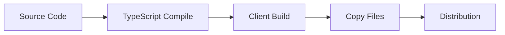

# Creevey Development Workflow

## Development Environment Setup

### Prerequisites

- Node.js >=18
- Yarn 4.9.1
- Docker (optional, for containerized testing)
- Git

### Initial Setup

```bash
# Clone repository
git clone <repository-url>
cd creevey

# Install dependencies
yarn install

# Setup git hooks
yarn prepare
```

### Development Commands

```bash
# Start development environment
yarn start                    # Starts client + Storybook + Creevey UI

# Build project
yarn build                    # Full production build
yarn build:client            # Build frontend only
yarn build:creevey           # Compile TypeScript only

# Testing
yarn test                     # Run all tests
yarn test path/to/test.test.ts # Run specific test
yarn test:watch              # Watch mode

# Code quality
yarn lint                     # Type check + lint + format check
yarn fix                      # Auto-fix linting and formatting
```

## Code Contribution Workflow

### 1. Feature Development

```bash
# Create feature branch
git checkout -b feature/new-feature

# Make changes
# ... develop feature ...

# Run tests and linting
yarn test
yarn lint

# Build to ensure no compilation errors
yarn build
```

### 2. Testing Strategy

- **Unit Tests**: Test utility functions and core logic
- **Integration Tests**: Test component interactions
- **E2E Tests**: Test complete workflows
- **Visual Tests**: Verify UI changes

### 3. Code Review Process

- Ensure all tests pass
- Check code coverage
- Verify documentation updates
- Confirm breaking changes are documented

### 4. Commit Guidelines

```bash
# Use conventional commits
git commit -m "feat: add new browser support"
git commit -m "fix: resolve screenshot capture issue"
git commit -m "docs: update configuration examples"
```

## Build and Release Process

### Build Pipeline



### Build Steps

1. **Clean**: Remove previous build artifacts
2. **Client Build**: Vite builds React UI
3. **TypeScript Compile**: Compile server code
4. **Copy Files**: Move necessary files to dist/
5. **Type Definitions**: Generate .d.ts files

### Release Process

```bash
# Update version
yarn version  # Updates CHANGELOG.md

# Build for release
yarn build

# Publish to npm
npm publish
```

## Testing Workflows

### Local Testing

```bash
# Quick test run
yarn creevey test --ui

# With Storybook auto-start
yarn creevey test -s --ui

# Debug mode
yarn creevey test --debug

# Specific browser
yarn creevey test --config .creevey/chrome.config.ts
```

### CI Testing

```bash
# Headless testing
yarn creevey test --no-docker

# With custom reporter
yarn creevey test --reporter junit

# Fail fast for quick feedback
yarn creevey test --fail-fast
```

### Test Configuration

```typescript
// .creevey/ci.config.ts
import { CreeveyConfig } from 'creevey';
import { PlaywrightWebdriver } from 'creevey/playwright';

const config: CreeveyConfig = {
  webdriver: PlaywrightWebdriver,
  useDocker: false,  // CI environments
  failFast: true,    // Quick feedback
  maxRetries: 2,     # Handle flaky tests
  browsers: {
    chrome: {
      browserName: 'chromium',
      viewport: { width: 1024, height: 768 },
    },
  },
};

export default config;
```

## Debugging Workflows

### Common Debugging Scenarios

#### 1. Test Failures

```bash
# Enable debug logging
yarn creevey test --debug

# View detailed diff images
yarn creevey report

# Check specific test
yarn creevey test --debug --story "Component/Story"
```

#### 2. Browser Issues

```bash
# Disable Docker for local debugging
yarn creevey test --no-docker

# Use headed browser
# In config: playwrightOptions: { headless: false }

# Enable traces (Playwright)
yarn creevey test --trace
```

#### 3. Storybook Connection

```bash
# Check Storybook accessibility
curl http://localhost:6006

# Verify stories loading
yarn creevey test --debug | grep "stories"

# Test with different Storybook URL
yarn creevey test --storybook-url http://localhost:9000
```

### Debug Tools

- **Browser DevTools**: Inspect captured elements
- **Network Tab**: Check Storybook requests
- **Console Logs**: View test execution logs
- **Diff Viewer**: Analyze image differences

## Configuration Management

### Environment-Specific Configs

```typescript
// .creevey/development.config.ts
export default {
  storybookUrl: 'http://localhost:6006',
  useDocker: true,
  debug: true,
};

// .creevey/ci.config.ts
export default {
  storybookUrl: process.env.STORYBOOK_URL,
  useDocker: false,
  failFast: true,
  reporter: 'junit',
};

// .creevey/production.config.ts
export default {
  storybookUrl: 'https://storybook.example.com',
  gridUrl: 'https://selenium-grid.example.com',
  browsers: {
    chrome: { limit: 5 },
    firefox: { limit: 3 },
  },
};
```

### Configuration Validation

```typescript
// TypeScript provides compile-time validation
import { CreeveyConfig } from 'creevey';

const config: CreeveyConfig = {
  // IDE will show type errors here
};
```

## Performance Optimization

### Test Performance

```typescript
// Optimize browser limits
browsers: {
  chrome: { limit: 2 },  // Based on CPU cores
  firefox: { limit: 1 },
},

// Use worker queue for large test suites
useWorkerQueue: true,

// Adjust timeouts appropriately
testTimeout: 30000,  // 30 seconds
```

### Build Performance

```bash
# Watch mode for development
yarn test:watch

# Incremental builds
yarn build:creevey  # Skip client build if not needed

# Parallel linting
yarn lint  # Runs typecheck, eslint, prettier in parallel
```

## Docker Workflows

### Development with Docker

```bash
# Use Docker for consistent testing
yarn creevey test --docker

# Custom Docker image
yarn creevey test --docker-image custom/browser:latest

# Docker Compose for complex setups
docker-compose up -d selenium-hub
yarn creevey test --grid-url http://localhost:4444
```

### Docker Configuration

```typescript
// Custom Docker registry
dockerAuth: {
  username: process.env.DOCKER_USER,
  password: process.env.DOCKER_PASS,
},

// Custom images
browsers: {
  chrome: {
    browserName: 'chrome',
    dockerImage: 'custom/chrome:123',
  },
},
```

## Integration Workflows

### CI/CD Integration

#### GitHub Actions

```yaml
- name: Run Visual Tests
  run: |
    yarn creevey test --no-docker --reporter junit
- name: Upload Results
  uses: actions/upload-artifact@v3
  with:
    name: creevey-report
    path: report/
```

#### GitLab CI

```yaml
visual_tests:
  script:
    - yarn creevey test --no-docker
  artifacts:
    reports:
      junit: report/junit.xml
    paths:
      - report/
```

### Storybook Integration

```typescript
// .storybook/main.ts
export default {
  stories: ['../src/**/*.stories.@(js|jsx|ts|tsx|mdx)'],
  addons: [
    // Creevey doesn't require Storybook addon
    // It reads parameters directly
  ],
};

// Story parameters
export default {
  title: 'Component',
  parameters: {
    creevey: {
      captureElement: '#root', // Custom capture
      ignoreElements: '.loading', // Ignore dynamic elements
    },
  },
};
```

## Troubleshooting Workflow

### Issue Diagnosis Steps

1. **Check Logs**: Use `--debug` flag
2. **Verify Configuration**: Validate config file
3. **Test Connectivity**: Check Storybook accessibility
4. **Isolate Issue**: Test with minimal configuration
5. **Check Environment**: Verify Docker/browser setup

### Common Issues and Solutions

- **Port Conflicts**: Change ports in configuration
- **Browser Launch Failures**: Check Docker/images
- **Story Loading Issues**: Verify Storybook URL and stories format
- **Image Comparison Failures**: Adjust threshold or capture settings

## Documentation Workflow

### Documentation Updates

- Update `docs/` for user-facing changes
- Update `AI_*.md` for architecture changes
- Update `AGENTS.md` for development guideline changes
- Update examples in `docs/examples/`

### Code Documentation

```typescript
/**
 * Creevey test context
 * Provides access to browser automation and assertions
 */
interface CreeveyTestContext {
  /** Browser name for current test */
  browserName: string;
  /** Webdriver instance for browser automation */
  webdriver: any;
  /** Capture screenshot of current state */
  takeScreenshot(): Promise<Buffer>;
  /** Compare screenshot with reference image */
  matchImage(image: Buffer | string): Promise<void>;
}
```

## Monitoring and Maintenance

### Health Checks

```bash
# Verify installation
yarn creevey --version

# Test configuration
yarn creevey test --config .creevey/config.ts --debug

# Check browser availability
yarn creevey test --no-docker --debug
```

### Maintenance Tasks

- Update Docker images regularly
- Clean up old test reports
- Monitor test execution times
- Review and update dependencies
- Check for deprecated API usage
