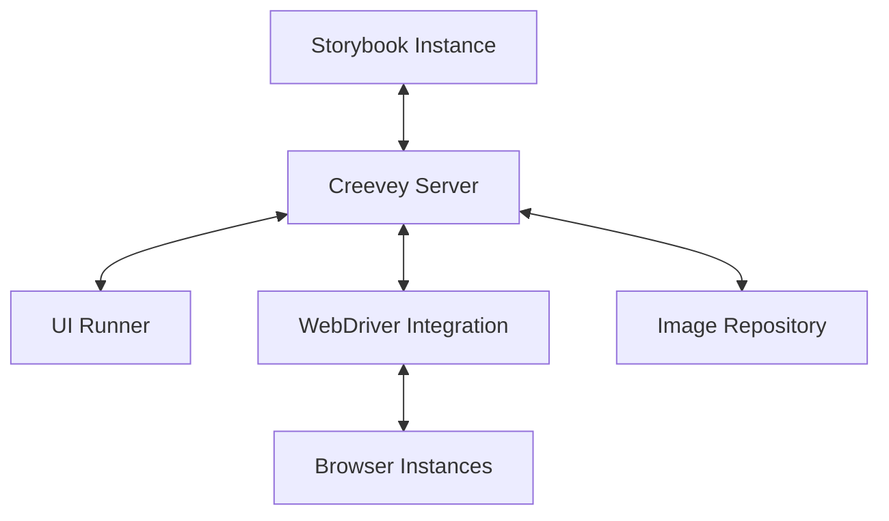

# Creevey Development Guide

This development guide provides comprehensive information for developers who want to use Creevey for visual regression testing in their projects. It covers setup, core concepts, configuration options, and best practices.

## Table of Contents

1. [Setup Instructions](#setup-instructions)
2. [Core Concepts](#core-concepts)
3. [API Documentation](#api-documentation)
4. [Configuration Options](#configuration-options)
5. [Example Workflows](#example-workflows)
6. [Best Practices](#best-practices)

## Setup Instructions

### Prerequisites

Before setting up Creevey, ensure you have the following:

- **Node.js**: Version 18.x or higher
- **Storybook**: Version 7.x or higher
- **Docker** (optional): Required for cross-browser testing with containerized browsers

### Installation

1. Install Creevey as a development dependency:

```bash
# Using npm
npm install --save-dev creevey

# Using yarn
yarn add -D creevey

# Using pnpm
pnpm add -D creevey
```

2. Add Creevey to your Storybook configuration:

```typescript
// .storybook/main.ts
import type { StorybookConfig } from '@storybook/your-framework';

const config: StorybookConfig = {
  stories: [
    /* ... */
  ],
  addons: [
    /* other addons */
    'creevey',
  ],
};

export default config;
```

3. Create a basic Creevey configuration file:

```typescript
// creevey.config.ts
import { CreeveyConfig } from 'creevey';
import { PlaywrightWebdriver } from 'creevey/playwright';
// or import { SeleniumWebdriver } from 'creevey/selenium';

const config: CreeveyConfig = {
  webdriver: PlaywrightWebdriver,
  browsers: {
    chromium: {
      browserName: 'chromium',
      viewport: { width: 1280, height: 720 },
    },
  },
};

export default config;
```

### Running Creevey

You can run Creevey in different modes:

1. **UI Mode**: Starts Creevey with a web-based UI for managing tests

```bash
yarn creevey --ui -s
```

2. **CLI Mode**: Runs tests in the command line and generates reports

```bash
yarn creevey
```

Options:

- `--ui`: Starts the UI Runner
- `-s, --storybookStart`: Automatically starts Storybook
- `-c, --config <path>`: Specify a custom config path
- `-p, --port <number>`: UI Runner port (default: 3000)
- `-d, --debug`: Enable debug output
- `-u, --update`: Approve all images from report directory
- `--reportDir <path>`: Specify report directory
- `--screenDir <path>`: Specify screenshots directory

## Core Concepts

### Visual Regression Testing

Creevey is designed for visual regression testing, which involves:

1. **Capturing screenshots** of your components in different states
2. **Comparing** those screenshots against baseline images
3. **Identifying visual differences** between current and baseline states
4. **Approving or rejecting** the changes

### Architecture Overview

Creevey's architecture consists of several key components:



### Test Types

Creevey supports two types of tests:

1. **Simple Screenshot Tests**: Captures screenshots of Storybook stories without additional interactions
2. **Interactive Tests**: Allows interactions with components before capturing screenshots

### Workflow Overview

The typical Creevey workflow follows these steps:

1. **Setup**: Configure Creevey for your project
2. **Write Stories**: Create Storybook stories for your components
3. **Initial Capture**: Run tests to capture baseline screenshots
4. **Approve Baselines**: Review and approve the initial screenshots
5. **Ongoing Testing**: Run tests as part of your development process
6. **Review Changes**: When tests fail, review the differences in the UI Runner
7. **Approve/Reject**: Approve changes that are expected or fix the issues causing unexpected changes

## API Documentation

### Test Context API

When writing interactive tests, you have access to a test context object:

```typescript
interface Context {
  // Take a screenshot and return its buffer
  takeScreenshot(): Promise<Buffer>;

  // Match the provided image against the baseline
  matchImage(image: Buffer): Promise<void>;

  // Match multiple images at once
  matchImages(images: Record<string, Buffer>): Promise<void>;

  // Access to the WebDriver instance (Playwright or Selenium)
  webdriver: PlaywrightBrowser | SeleniumBrowser;

  // Test metadata
  testName: string;
  browserName: string;
  storyId: string;
  storyPath: string[];
}
```

### Writing Tests

Tests can be written in two ways:

#### 1. Using `*.creevey.ts` files:

```typescript
// Button.creevey.ts
import { kind, story, test } from 'creevey';

kind('Components/Button', () => {
  story('Primary', ({ setStoryParameters }) => {
    // Optional: Set story-specific parameters
    setStoryParameters({
      captureElement: '.button-container',
    });

    // Basic test - just capture the story
    test('default', async (context) => {
      await context.matchImage(await context.takeScreenshot());
    });

    // Interactive test - with user actions
    test('hover', async (context) => {
      // Hover over the button
      const button = await context.webdriver.findElement('button');
      await button.hover();

      // Capture and match the screenshot
      await context.matchImage(await context.takeScreenshot());
    });
  });
});
```

#### 2. Using Storybook's `play` function:

```typescript
// Button.stories.tsx
import type { Meta, StoryObj } from '@storybook/react';
import { within, userEvent } from '@storybook/testing-library';
import { Button } from './Button';

const meta: Meta<typeof Button> = {
  title: 'Components/Button',
  component: Button,
};

export default meta;

export const Primary: StoryObj<typeof Button> = {
  play: async ({ canvasElement }) => {
    const canvas = within(canvasElement);
    const button = canvas.getByRole('button');
    await userEvent.hover(button);
  },
};
```

## Configuration Options

Creevey offers extensive configuration options to tailor testing to your needs:

### Basic Configuration

```typescript
// creevey.config.ts
import { CreeveyConfig } from 'creevey';
import { PlaywrightWebdriver } from 'creevey/playwright';

const config: CreeveyConfig = {
  webdriver: PlaywrightWebdriver, // Use Playwright for browser automation

  // Storybook URL (defaults to http://localhost:6006)
  storybookUrl: 'http://localhost:9000',

  // Directory for reference screenshots (default: '.creevey/reference')
  screenDir: './screenshots',

  // Directory for test reports (default: '.creevey/report')
  reportDir: './reports',

  // Image comparison options (using pixelmatch)
  diffOptions: {
    threshold: 0.1, // Tolerance for pixel differences (0-1)
  },
};

export default config;
```

### Browser Configuration

Configure multiple browsers for cross-browser testing:

```typescript
// creevey.config.ts
const config: CreeveyConfig = {
  // ... other options
  browsers: {
    chrome: {
      browserName: 'chrome', // For Selenium
      viewport: { width: 1280, height: 720 },
      limit: 2, // Parallel instances
      maxRetries: 3, // Retry failed tests
    },
    firefox: {
      browserName: 'firefox',
      viewport: { width: 1280, height: 720 },
    },
    // For Playwright
    chromium: {
      browserName: 'chromium',
      playwrightOptions: {
        headless: true,
        channel: 'chrome',
      },
    },
  },
};
```

### Docker Configuration

Configure Docker for isolated browser testing:

```typescript
// creevey.config.ts
const config: CreeveyConfig = {
  // ... other options
  useDocker: true,
  dockerImage: 'aerokube/selenoid:latest-release',
  pullImages: true,
  dockerImagePlatform: 'linux/amd64',
};
```

### Test Filtering

Filter which tests to run:

```typescript
// creevey.config.ts
const config: CreeveyConfig = {
  // ... other options

  // Only run tests matching these patterns
  include: ['Button/**', 'Form/**'],

  // Skip tests matching these patterns
  exclude: ['**/Deprecated/**'],
};
```

## Example Workflows

### Basic Screenshot Testing

```typescript
// Button.creevey.ts
import { kind, story, test } from 'creevey';

kind('Components/Button', () => {
  story('Primary', () => {
    test('default', async (context) => {
      await context.matchImage(await context.takeScreenshot());
    });
  });
});
```

### Testing Component States

```typescript
// Input.creevey.ts
import { kind, story, test } from 'creevey';

kind('Forms/Input', () => {
  story('Text', () => {
    test('states', async (context) => {
      const { webdriver } = context;
      const input = await webdriver.findElement('input');

      // Capture default state
      const defaultState = await context.takeScreenshot();

      // Focus the input
      await input.click();
      const focusedState = await context.takeScreenshot();

      // Type into the input
      await input.type('Hello, Creevey!');
      const filledState = await context.takeScreenshot();

      // Match all states at once
      await context.matchImages({
        default: defaultState,
        focused: focusedState,
        filled: filledState,
      });
    });
  });
});
```

### Testing Responsive Behavior

```typescript
// Card.creevey.ts
import { kind, story, test } from 'creevey';

kind('Components/Card', () => {
  story('Default', () => {
    test('responsive', async (context) => {
      const { webdriver } = context;

      // Desktop size
      await webdriver.setViewportSize({ width: 1280, height: 720 });
      const desktop = await context.takeScreenshot();

      // Tablet size
      await webdriver.setViewportSize({ width: 768, height: 1024 });
      const tablet = await context.takeScreenshot();

      // Mobile size
      await webdriver.setViewportSize({ width: 375, height: 667 });
      const mobile = await context.takeScreenshot();

      await context.matchImages({ desktop, tablet, mobile });
    });
  });
});
```

### CI Pipeline Integration

Example GitHub Actions workflow:

```yaml
# .github/workflows/visual-tests.yml
name: Visual Regression Tests

on:
  push:
    branches: [main]
  pull_request:
    branches: [main]

jobs:
  visual-tests:
    runs-on: ubuntu-latest

    steps:
      - uses: actions/checkout@v3
        with:
          fetch-depth: 0 # Required for comparing with base branch

      - name: Setup Node.js
        uses: actions/setup-node@v3
        with:
          node-version: '18'
          cache: 'yarn'

      - name: Install dependencies
        run: yarn install --frozen-lockfile

      - name: Run visual tests
        run: yarn creevey --update-on-new-stories

      - name: Upload test reports
        uses: actions/upload-artifact@v3
        if: always()
        with:
          name: creevey-report
          path: .creevey/report
```

## Best Practices

### Writing Effective Tests

1. **Keep stories focused**: Each story should represent a single clear state of a component.

2. **Use story parameters**: Configure Creevey specifically for each story:

   ```typescript
   export const Primary = {
     args: { label: 'Primary Button' },
     creevey: {
       captureElement: '.button-wrapper',
       ignoreElements: ['.timestamp', '.random-content'],
     },
   };
   ```

3. **Group related screenshots**: Use the `matchImages` function to group related states:

   ```typescript
   test('button states', async (context) => {
     // Capture different states and match them all together
     await context.matchImages({
       idle: idleScreenshot,
       hover: hoverScreenshot,
       active: activeScreenshot,
       disabled: disabledScreenshot,
     });
   });
   ```

4. **Make tests deterministic**: Ensure tests produce the same visual output each time:
   - Set fixed dimensions for components
   - Mock dynamic content
   - Disable animations
   - Use consistent test data

### Handling Flaky Tests

1. **Adjust threshold**: For minor rendering differences:

   ```typescript
   // creevey.config.ts
   const config: CreeveyConfig = {
     diffOptions: { threshold: 0.1 },
   };
   ```

2. **Ignore dynamic elements**:

   ```typescript
   export const MyStory = {
     creevey: {
       ignoreElements: ['.timestamp', '.random-number'],
     },
   };
   ```

3. **Use retries for flaky tests**:

   ```typescript
   // creevey.config.ts
   const config: CreeveyConfig = {
     browsers: {
       chrome: {
         maxRetries: 3,
       },
     },
   };
   ```

4. **Fix rendering inconsistencies**:
   - Replace `1px solid` borders with `box-shadow: 0 0 0 1px` for consistent rendering
   - Use whole pixel values for dimensions
   - Disable border-radius with 1px borders when testing in Chrome

### Organization Tips

1. **Structure test files**: Keep test files alongside story files:

   ```
   src/
   ├── components/
   │   ├── Button/
   │   │   ├── Button.tsx
   │   │   ├── Button.stories.tsx
   │   │   └── Button.creevey.ts
   ```

2. **CI Integration**: Run Creevey as part of your CI/CD pipeline:

   - Run tests on PRs to detect visual changes
   - Maintain a reference screenshot repository
   - Archive test reports as artifacts

3. **Team Workflow**:

   - Review visual changes as part of code review
   - Update baseline screenshots when intended changes are approved
   - Document reasons for visual changes

4. **Performance Optimization**:
   - Use parallel browser instances (`limit` option)
   - Only test affected components when possible
   - Consider separating visual tests from unit tests in CI pipeline

### Troubleshooting Common Issues

1. **Docker-related issues**:

   - Ensure Docker is running
   - Check Docker permissions
   - Increase container memory limits if needed

2. **Browser-specific rendering differences**:

   - Create separate reference screenshots for each browser
   - Use more permissive thresholds for cross-browser testing

3. **Test timeouts**:

   - Increase timeout values for complex components
   - Ensure stable network for external resources
   - Simplify test scenarios if needed

4. **Image comparison failures**:
   - Review the differences in the UI Runner
   - Look for dynamic content that should be ignored
   - Check for animation or transition effects
