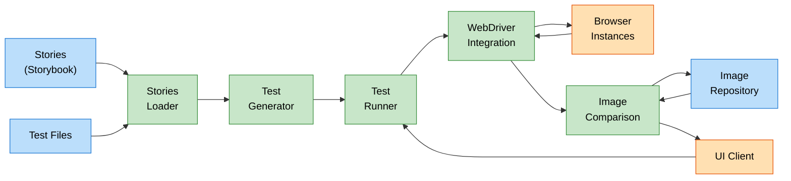
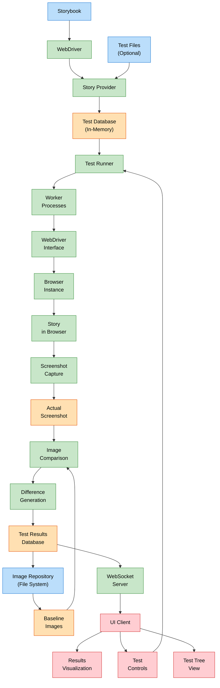
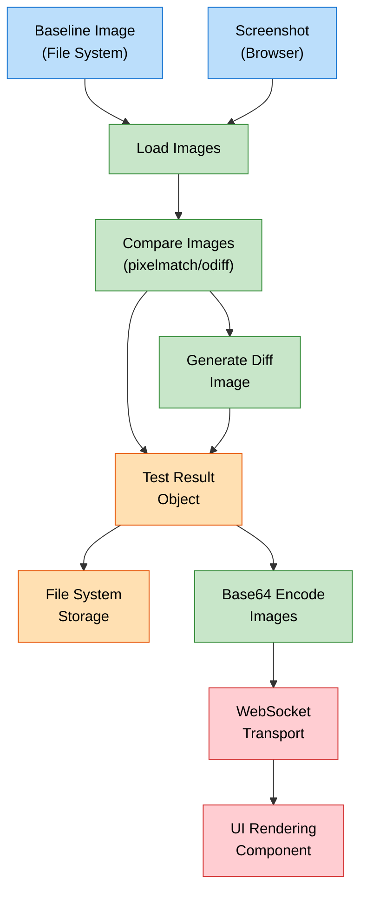
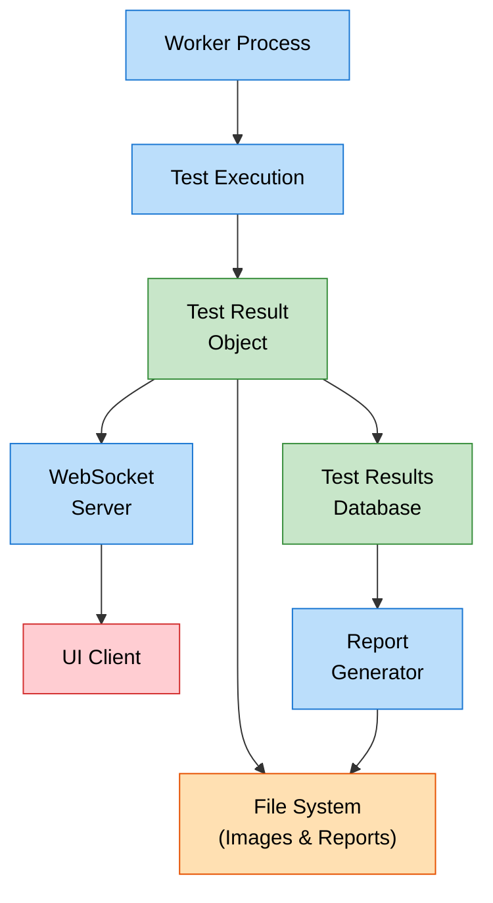
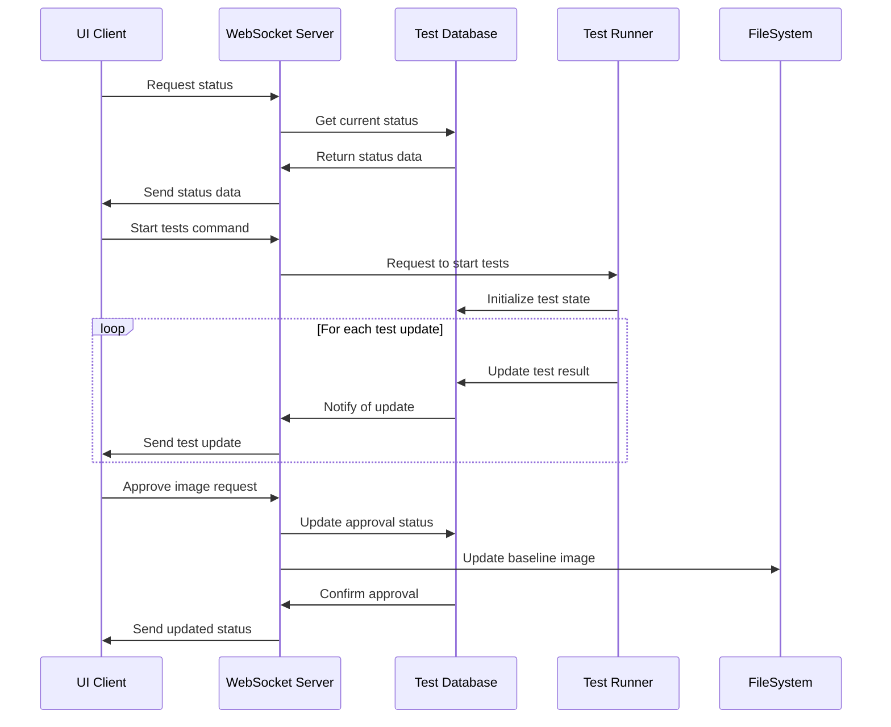
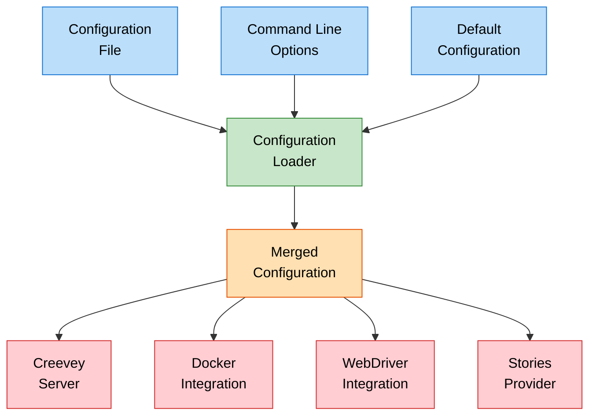

# Data Flow Diagram for Creevey

This document illustrates the flow of data through the Creevey system, from test initialization to results visualization.

## High-Level Data Flow



## Detailed Data Flow



## Image Data Flow



## Test Result Data Flow



## WebSocket Communication Data Flow



## Configuration Data Flow



## Key Data Entities

### Story Data Structure

```typescript
interface StoryData {
  id: string;
  title: string;
  component: any;
  parameters: {
    creevey?: CreeveyStoryParams;
    [key: string]: any;
  };
}
```

### Test Data Structure

```typescript
interface TestData {
  id: string;
  storyPath: string[];
  browser: string;
  testName?: string;
  storyId: string;
  skip?: boolean | string;
  retries?: number;
  status?: TestStatus;
  results?: TestResult[];
  approved?: Record<string, number> | null;
}
```

### Test Result Structure

```typescript
interface TestResult {
  status: 'failed' | 'success';
  retries: number;
  images?: Record<
    string,
    {
      actual: string;
      expect?: string;
      diff?: string;
      error?: string;
    }
  >;
  error?: string;
  duration?: number;
  attachments?: string[];
  sessionId?: string;
  browserName?: string;
  workerId?: number;
}
```

## Data Flow Phases

1. **Configuration Phase**:

   - Load configuration from files and CLI
   - Merge with defaults
   - Distribute to components

2. **Story Discovery Phase**:

   - Load stories from Storybook
   - Load test files (optional)
   - Merge into test database

3. **Test Execution Phase**:

   - Distribute tests to workers
   - Control browsers via WebDriver
   - Capture screenshots

4. **Image Processing Phase**:

   - Compare actual vs baseline
   - Generate difference images
   - Update test results

5. **Reporting Phase**:
   - Send real-time updates to UI
   - Generate static reports
   - Update file system

## Related Diagrams

This data flow diagram should be viewed alongside:

- System Architecture Overview
- Test Execution Flow Diagram
- WebDriver Integration Architecture
- UI Architecture Diagram
