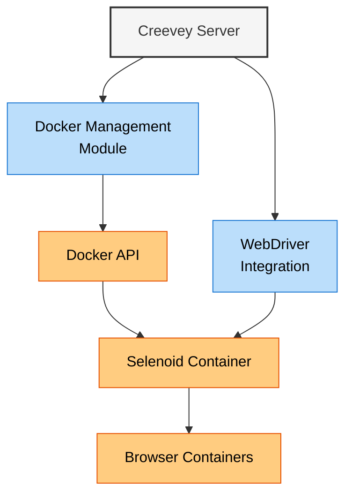
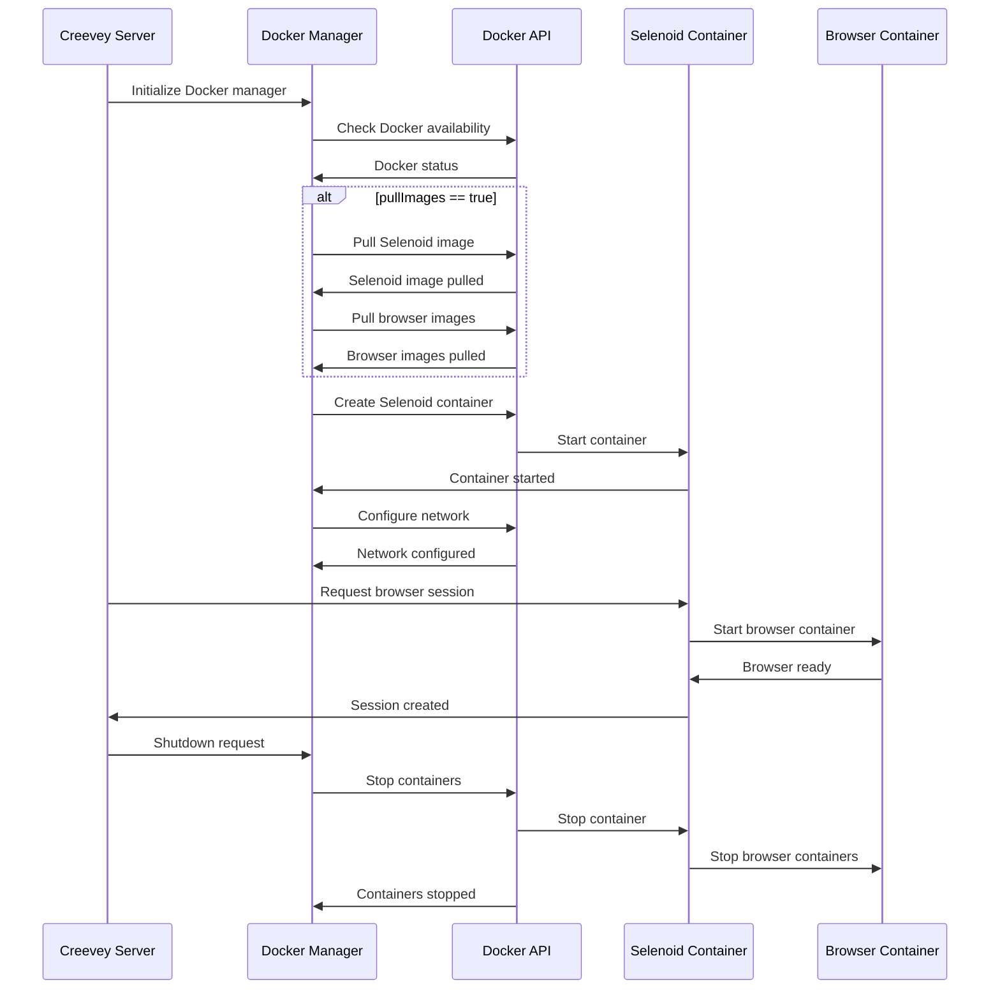
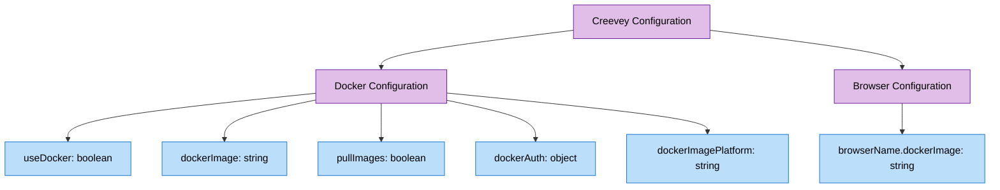
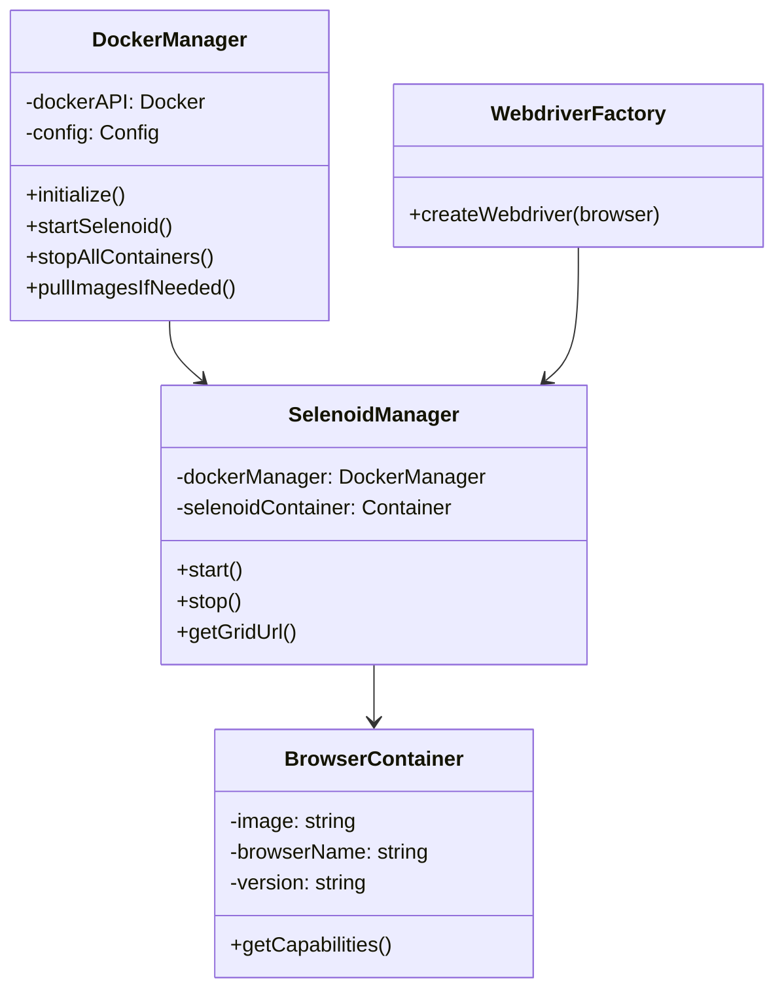
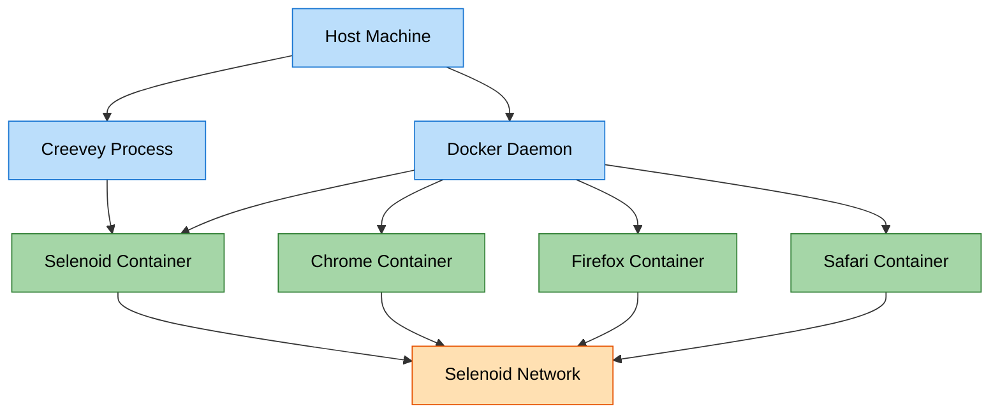
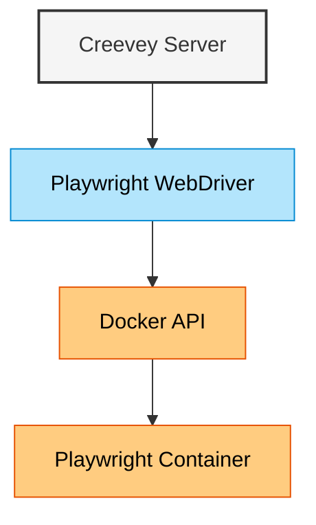

# Docker Integration Architecture

This document illustrates the Docker integration architecture in Creevey, showing how containers are managed for browser isolation.

## Docker Integration Overview



## Docker Container Setup Flow



## Docker Configuration System



## Docker Integration Architecture



## Docker Container Architecture



## Playwright Direct Docker Integration



## Docker Configuration Example

Here's a simplified example of how Creevey configures Docker in the code:

```typescript
// Default Docker Configuration
const defaultConfig = {
  useDocker: true,
  dockerImage: 'aerokube/selenoid:latest-release',
  pullImages: true,
  dockerImagePlatform: 'linux/amd64',
  browsers: {
    chrome: {
      browserName: 'chrome',
      dockerImage: 'selenoid/chrome:latest',
    },
    firefox: {
      browserName: 'firefox',
      dockerImage: 'selenoid/firefox:latest',
    },
  },
};

// Docker Manager Implementation
class DockerManager {
  async initialize() {
    if (!this.config.useDocker) return;

    await this.checkDocker();

    if (this.config.pullImages) {
      await this.pullImages();
    }

    await this.startSelenoid();
  }

  // Other methods...
}
```

## Key Integration Points

1. **Docker API Integration**

   - Uses Docker API to manage containers
   - Controls container lifecycle (create, start, stop)
   - Configures networking between containers

2. **Selenoid Integration**

   - Manages Selenoid as a Docker container
   - Automatically starts Selenoid when Creevey launches
   - Provides connection URL to WebDriver implementations

3. **Browser Containers**

   - Dynamically launches browser containers as needed
   - Supports multiple browser types and versions
   - Isolates browser instances for test reliability

4. **Alternative: Direct Playwright Docker Integration**
   - Option to use Playwright containers directly
   - Bypasses Selenoid for Playwright browser automation
   - Uses specialized Playwright Docker images

## Related Diagrams

This Docker integration diagram should be viewed alongside:

- System Architecture Overview
- WebDriver Integration Architecture
- Test Execution Flow
