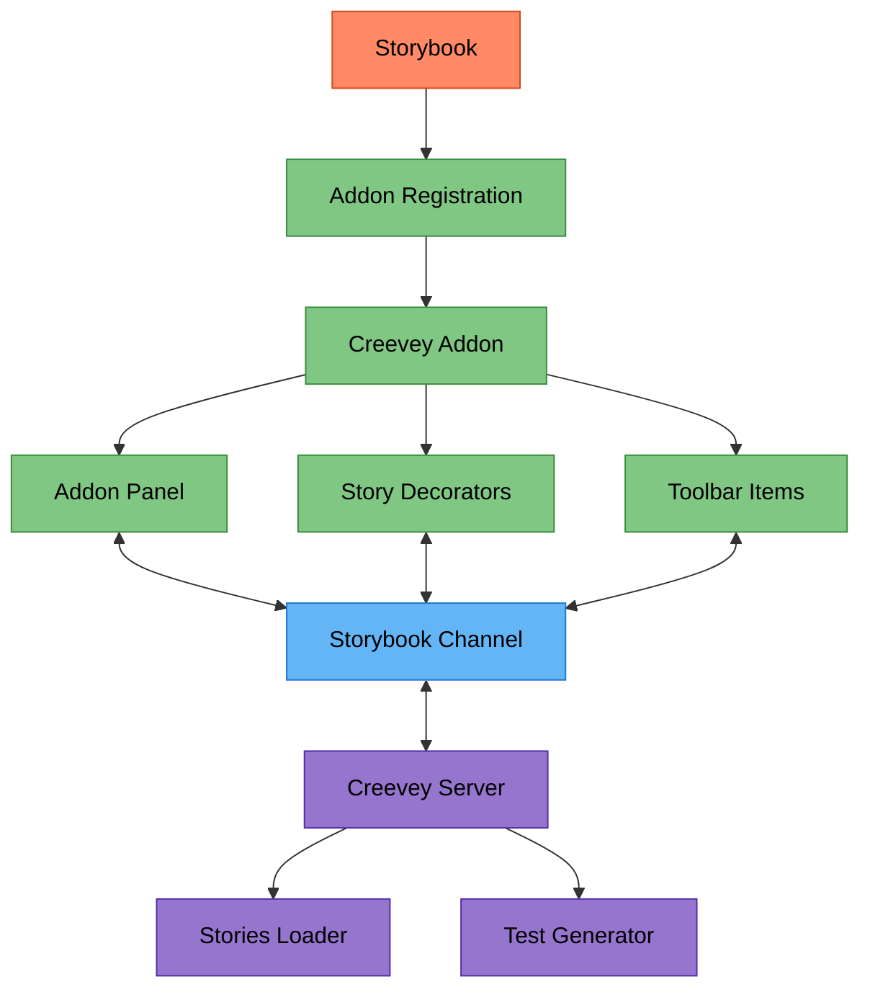
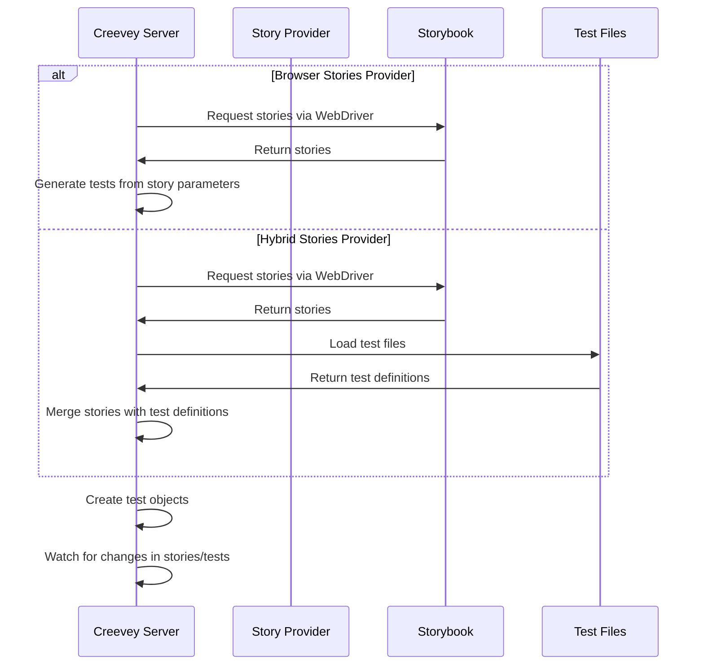
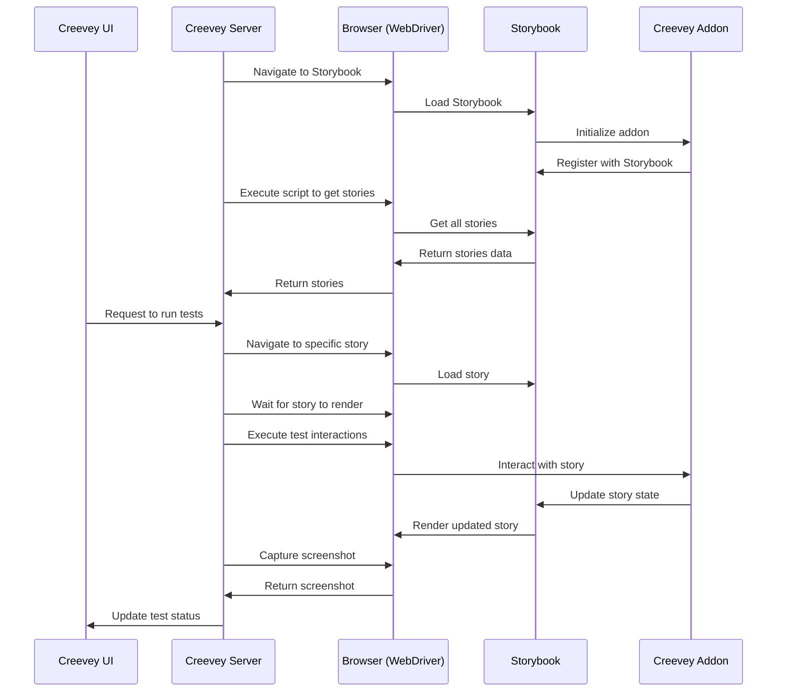
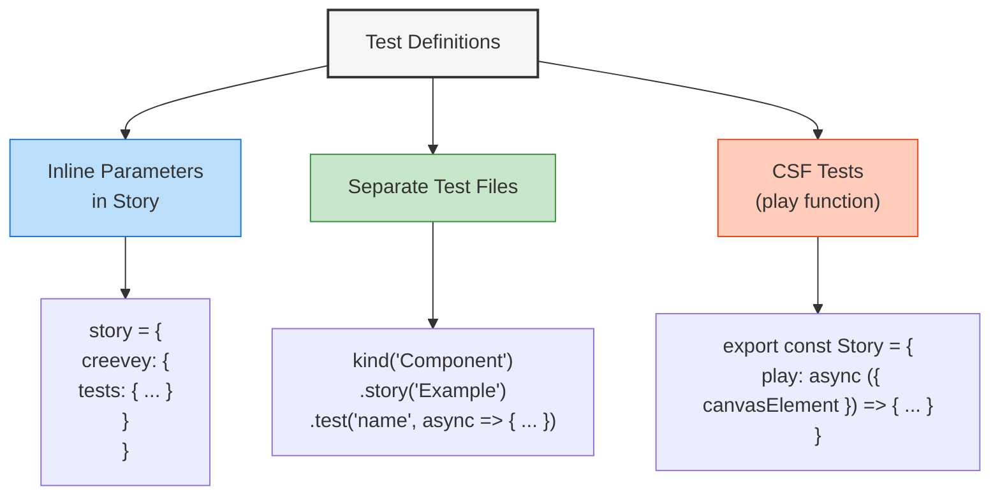
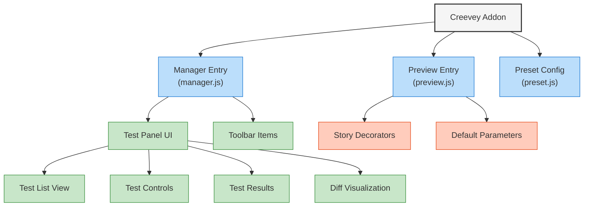
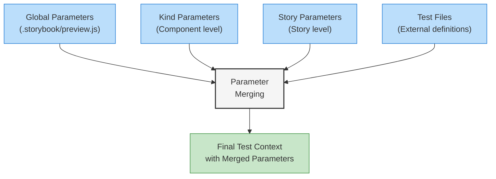

# Storybook Integration Architecture

This document illustrates how Creevey integrates with Storybook as an addon and how it discovers, loads, and tests stories.

## Storybook Addon Architecture



## Story Discovery and Loading



## Story Provider Architecture

```mermaid
classDiagram
    class StoriesProvider {
        <<interface>>
        (config, storiesListener, webdriver) => Promise<StoriesRaw>
        +providerName?: string
    }

    class BrowserStoriesProvider {
        +providerName: "browser"
        -loadStoriesFromBrowser(webdriver)
        +extract CSF stories
    }

    class HybridStoriesProvider {
        +providerName: "hybrid"
        -loadStoriesFromBrowser(webdriver)
        -loadTestsFromFiles(config)
        +merge stories and tests
    }

    StoriesProvider <|.. BrowserStoriesProvider
    StoriesProvider <|.. HybridStoriesProvider
```

## Communication Flow Between Storybook and Creevey



## Test Definition Methods

Creevey supports multiple ways to define tests:



## Storybook Addon Component Structure



## Storybook Parameter Merging



## Key Integration Points

1. **Addon Registration**

   - Registers with Storybook's addon system
   - Creates UI panels in Storybook

2. **Channel-based Communication**

   - Uses Storybook's channel for communication
   - Listens for story events

3. **Story Discovery**

   - Extracts stories from Storybook
   - Merges with external test definitions

4. **Test Execution**

   - Controls story navigation and rendering
   - Executes test interactions
   - Captures screenshots

5. **Result Visualization**
   - Displays test results in Storybook UI
   - Provides tools for approving/rejecting changes

## Storybook Events Used

Creevey interacts with Storybook through these events:

```
SET_STORIES
SET_CURRENT_STORY
FORCE_REMOUNT
STORY_RENDERED
STORY_ERRORED
STORY_THREW_EXCEPTION
UPDATE_STORY_ARGS
SET_GLOBALS
UPDATE_GLOBALS
```

## Related Diagrams

This Storybook integration diagram should be viewed alongside:

- System Architecture Overview
- Test Execution Flow Diagram
- WebDriver Integration Architecture
- Client-Server Communication Diagram
