# Creevey System Overview Diagram

This document contains the high-level system overview diagram for Creevey, showing the major components and their relationships.

## System Architecture Overview

```mermaid
graph TD
    %% Main System Components
    Client["Client Layer<br>(UI Runner)"]
    Server["Server Layer<br>(Test Orchestration)"]
    Workers["Worker Processes<br>(Parallel Execution)"]
    Browsers["Browser Instances<br>(Selenium/Playwright)"]
    ImageComp["Image Comparison<br>(pixelmatch/odiff)"]
    Docker["Docker Integration<br>(Container Management)"]
    Stories["Story Providers<br>(test discovery)"]
    Storybook["Storybook<br>(Component Development)"]
    FileSystem["File System<br>(Images & Reports)"]
    CISystem["CI/CD Systems<br>(Automated Testing)"]

    %% Client-side Components
    subgraph "Client Components"
        UI["UI Components"]
        WebSocketClient["WebSocket Client"]
        TestViz["Test Visualization"]
        ImgCompViz["Image Comparison<br>Visualization"]
        TestMgmt["Test Management"]
    end

    %% Server-side Components
    subgraph "Server Components"
        WebSocketServer["WebSocket Server"]
        TestRunner["Test Runner"]
        WorkerMgmt["Worker Management"]
        ConfigMgmt["Configuration<br>Management"]
        ResultsMgmt["Results Management"]
        StoriesLoader["Stories Loader"]
        WebDriverInteg["WebDriver<br>Integration"]
        DockerMgmt["Docker Management"]
    end

    %% Storybook Integration
    subgraph "Storybook Integration"
        StorybookAddon["Storybook Addon"]
        StorybookChannel["Storybook Channel"]
        StorybookAPI["Storybook API"]
    end

    %% High-level Connections
    Client <--> Server
    Server <--> Workers
    Workers <--> Browsers
    Server <--> ImageComp
    Server <--> Docker
    Server <--> Stories
    Stories <--> Storybook
    Server <--> FileSystem
    Server <--> CISystem

    %% Client Component Connections
    Client --- UI
    Client --- WebSocketClient
    Client --- TestViz
    Client --- ImgCompViz
    Client --- TestMgmt

    %% Server Component Connections
    Server --- WebSocketServer
    Server --- TestRunner
    Server --- WorkerMgmt
    Server --- ConfigMgmt
    Server --- ResultsMgmt
    Server --- StoriesLoader
    Server --- WebDriverInteg
    Server --- DockerMgmt

    %% Storybook Integration Connections
    Storybook --- StorybookAddon
    Storybook --- StorybookChannel
    Storybook --- StorybookAPI

    %% Detailed Connections
    WebSocketClient <--> WebSocketServer
    StoriesLoader <--> Stories
    WebDriverInteg <--> Workers
    DockerMgmt <--> Docker
    StorybookAddon <--> StorybookChannel
    StorybookChannel <--> StorybookAPI
    Workers <-.-> ResultsMgmt
    TestRunner <-.-> WorkerMgmt
    TestViz <-.-> TestMgmt

    %% Styling
    classDef clientComponent fill:#a7c4f2,stroke:#2c5aa0,color:black
    classDef serverComponent fill:#a7f2c0,stroke:#2c8d54,color:black
    classDef storybookComponent fill:#f2a7e2,stroke:#912c82,color:black
    classDef externalSystem fill:#f2d0a7,stroke:#8d5d2c,color:black
    classDef mainComponent fill:#e0e0e0,stroke:#333333,color:black,stroke-width:2px

    class Client,Server,Workers,Browsers,ImageComp,Docker,Stories,Storybook,FileSystem,CISystem mainComponent
    class UI,WebSocketClient,TestViz,ImgCompViz,TestMgmt clientComponent
    class WebSocketServer,TestRunner,WorkerMgmt,ConfigMgmt,ResultsMgmt,StoriesLoader,WebDriverInteg,DockerMgmt serverComponent
    class StorybookAddon,StorybookChannel,StorybookAPI storybookComponent
    class Browsers,FileSystem,CISystem externalSystem
```

## Key Components

### Client Layer

- **UI Runner**: Web-based interface for test visualization and management
- **WebSocket Client**: Real-time communication with server
- **Test Visualization**: Display of test results and status
- **Image Comparison Visualization**: Tools for viewing and comparing screenshots
- **Test Management**: Interface for running, approving, and managing tests

### Server Layer

- **WebSocket Server**: Handles real-time communication with clients
- **Test Runner**: Orchestrates test execution
- **Worker Management**: Manages parallel test execution via worker processes
- **Configuration Management**: Handles user configuration and settings
- **Results Management**: Processes and stores test results
- **Stories Loader**: Discovers and loads stories from Storybook
- **WebDriver Integration**: Interfaces with Selenium and Playwright
- **Docker Management**: Manages Docker containers for browser isolation

### Worker Processes

- Isolated processes for parallel test execution
- Communicate with server via IPC
- Control browser instances
- Execute tests in parallel

### External Components

- **Browser Instances**: Controlled via WebDriver
- **Docker Containers**: Isolated environments for browsers
- **Storybook**: Component development environment
- **File System**: Storage for screenshots and reports
- **CI/CD Systems**: Integration for automated testing

## Communication Flows

1. **Client-Server Communication**:

   - WebSocket-based real-time communication
   - Test status updates and control commands

2. **Server-Worker Communication**:

   - Inter-process communication (IPC)
   - Worker registration and coordination
   - Test assignments and results reporting

3. **Storybook Integration**:

   - Channel-based communication via Storybook API
   - Story discovery and loading
   - Test execution within Storybook context

4. **WebDriver Communication**:

   - Control of browser instances
   - Screenshot capture
   - Browser interaction handling

5. **Docker Integration**:
   - Container lifecycle management
   - Network configuration
   - Resource allocation

## Next Steps

This high-level overview will be supplemented with:

1. Detailed component interaction diagrams
2. Data flow diagrams
3. Sequence diagrams for key processes
4. Detailed subsystem architecture diagrams
