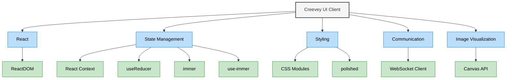
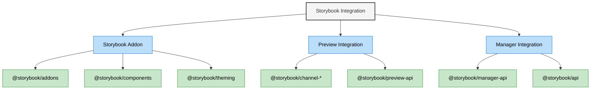
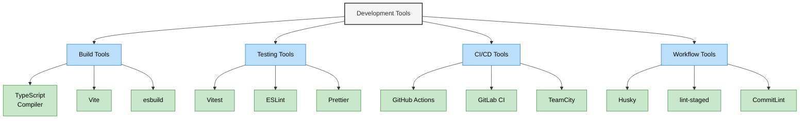
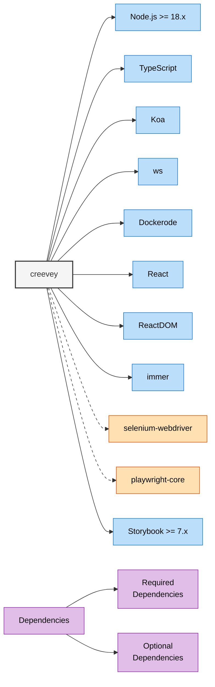

# Technology Stack Diagram for Creevey

This document illustrates the technology stack used in Creevey, showing the main frameworks, libraries, and tools across different components.

## Overall Technology Stack

```mermaid
graph TD
    %% Main Layers
    Lang["Languages"]
    Core["Core Technologies"]
    Server["Server Stack"]
    UI["UI Stack"]
    Testing["Testing Stack"]
    Build["Build Tools"]

    %% Languages
    Lang --> TS["TypeScript"]
    Lang --> JS["JavaScript"]

    %% Core
    Core --> Node["Node.js"]
    Core --> NPM["npm/yarn"]
    Core --> Docker["Docker"]

    %% Server
    Server --> Koa["Koa"]
    Server --> WS["WebSockets"]
    Server --> Dockerode["Dockerode"]

    %% UI
    UI --> React["React"]
    UI --> CSS["CSS Modules"]
    UI --> Storybook["Storybook"]

    %% Testing
    Testing --> Selenium["Selenium WebDriver"]
    Testing --> Playwright["Playwright"]
    Testing --> Pixelmatch["Pixelmatch"]
    Testing --> ODiff["odiff-bin"]

    %% Build
    Build --> TSC["TypeScript Compiler"]
    Build --> Vite["Vite"]
    Build --> ESLint["ESLint"]

    %% Styling
    classDef language fill:#bbdefb,stroke:#1976d2,color:black
    classDef core fill:#c8e6c9,stroke:#388e3c,color:black
    classDef server fill:#ffe0b2,stroke:#e65100,color:black
    classDef ui fill:#e1bee7,stroke:#8e24aa,color:black
    classDef testing fill:#ffcdd2,stroke:#d32f2f,color:black
    classDef build fill:#b3e5fc,stroke:#0288d1,color:black

    class Lang,TS,JS language
    class Core,Node,NPM,Docker core
    class Server,Koa,WS,Dockerode server
    class UI,React,CSS,Storybook ui
    class Testing,Selenium,Playwright,Pixelmatch,ODiff testing
    class Build,TSC,Vite,ESLint build
```

## Component-Specific Technology Stacks

### Server-Side Technology Stack

```mermaid
graph TD
    %% Core Server
    Server["Creevey Server"]

    %% Major Components
    Server --> WebServer["Web Server"]
    Server --> WorkerMgmt["Worker Management"]
    Server --> WSServer["WebSocket Server"]
    Server --> DockerInteg["Docker Integration"]
    Server --> WebDriverInteg["WebDriver Integration"]
    Server --> ImageProc["Image Processing"]

    %% Technologies
    WebServer --> Koa["Koa"]
    WebServer --> KoaStatic["koa-static"]
    WebServer --> KoaMount["koa-mount"]
    WebServer --> KoaCors["@koa/cors"]

    WorkerMgmt --> NodeCluster["Node.js Cluster"]
    WorkerMgmt --> NodeIPC["Node.js IPC"]

    WSServer --> WS["ws (WebSockets)"]

    DockerInteg --> Dockerode["Dockerode"]

    WebDriverInteg --> SeleniumWD["selenium-webdriver"]
    WebDriverInteg --> PlaywrightCore["playwright-core"]

    ImageProc --> Pixelmatch["Pixelmatch"]
    ImageProc --> ODiff["odiff-bin"]
    ImageProc --> PNGjs["pngjs"]

    %% Styling
    classDef server fill:#f5f5f5,stroke:#333,stroke-width:2px
    classDef component fill:#bbdefb,stroke:#1976d2,color:black
    classDef lib fill:#c8e6c9,stroke:#388e3c,color:black

    class Server server
    class WebServer,WorkerMgmt,WSServer,DockerInteg,WebDriverInteg,ImageProc component
    class Koa,KoaStatic,KoaMount,KoaCors,NodeCluster,NodeIPC,WS,Dockerode,SeleniumWD,PlaywrightCore,Pixelmatch,ODiff,PNGjs lib
```

### Client-Side Technology Stack

### Storybook Integration Stack

### WebDriver Technology Stack

```mermaid
graph TD
    %% Core WebDriver
    WebDriver["WebDriver Integration"]

    %% Implementations
    WebDriver --> Selenium["Selenium Integration"]
    WebDriver --> Playwright["Playwright Integration"]

    %% Selenium Stack
    Selenium --> SeleniumWD["selenium-webdriver"]
    Selenium --> Builder["Builder API"]
    Selenium --> ChromeDriver["ChromeDriver"]
    Selenium --> GeckoDriver["GeckoDriver"]

    %% Playwright Stack
    Playwright --> PWCore["playwright-core"]
    Playwright --> Chromium["Chromium API"]
    Playwright --> Firefox["Firefox API"]
    Playwright --> WebKit["WebKit API"]

    %% Docker Integration
    WebDriver --> Selenoid["Selenoid"]
    Selenoid --> SelenoidDocker["selenoid/chrome, etc."]

    WebDriver --> PWDocker["Playwright Docker"]
    PWDocker --> MCRDocker["mcr.microsoft.com/playwright"]

    %% Styling
    classDef webdriver fill:#f5f5f5,stroke:#333,stroke-width:2px
    classDef impl fill:#bbdefb,stroke:#1976d2,color:black
    classDef lib fill:#c8e6c9,stroke:#388e3c,color:black
    classDef docker fill:#ffe0b2,stroke:#e65100,color:black

    class WebDriver webdriver
    class Selenium,Playwright impl
    class SeleniumWD,Builder,ChromeDriver,GeckoDriver,PWCore,Chromium,Firefox,WebKit lib
    class Selenoid,PWDocker,SelenoidDocker,MCRDocker docker
```

## Development Tools & Dependencies

## Dependency Relationships

## Technology Stack Summary

Creevey is built with a modern JavaScript/TypeScript stack:

### Core Technologies

- **Language**: TypeScript
- **Runtime**: Node.js
- **Container**: Docker

### Server-Side

- **Web Server**: Koa
- **WebSockets**: ws
- **Docker Integration**: Dockerode
- **WebDriver**: selenium-webdriver, playwright-core
- **Image Processing**: pixelmatch, odiff-bin, pngjs

### Client-Side

- **UI Framework**: React
- **State Management**: React Context + Immer
- **Styling**: CSS Modules
- **Visualization**: Canvas API

### Storybook Integration

- **Addon APIs**: @storybook/addons
- **UI Components**: @storybook/components
- **Theming**: @storybook/theming

### Development Tools

- **Build**: TypeScript Compiler, Vite
- **Linting**: ESLint, Prettier
- **Testing**: Vitest
- **CI/CD**: GitHub Actions, GitLab CI, TeamCity

## Related Diagrams

This technology stack diagram should be viewed alongside:

- System Architecture Overview
- Component Interaction Diagram
- Data Flow Diagram
