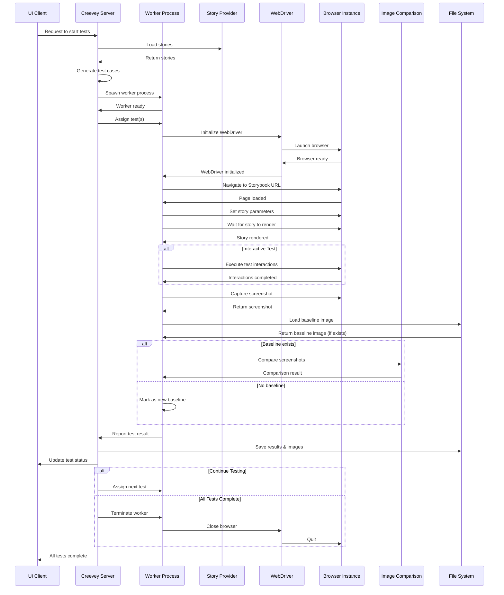
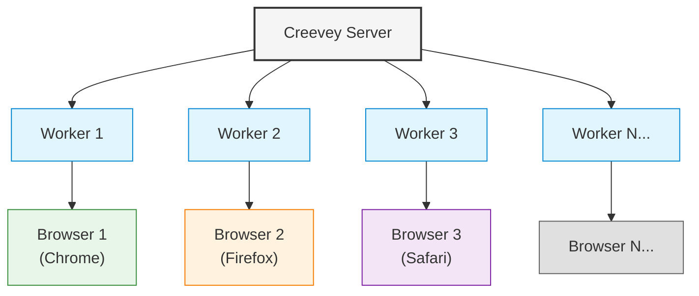
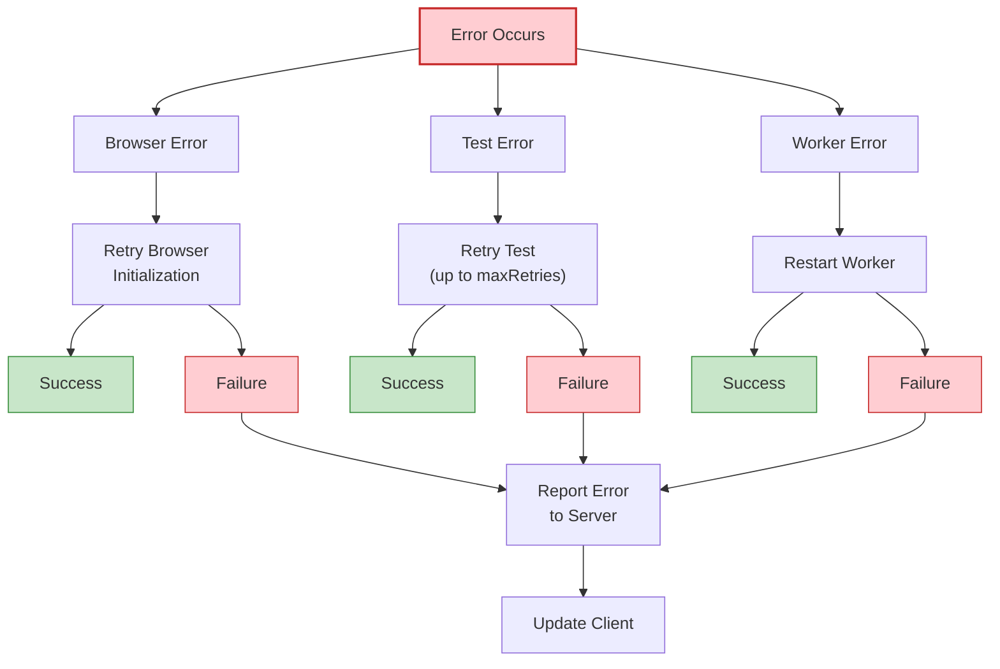

# Test Execution Flow Diagram

This document illustrates the detailed sequence of test execution in Creevey, from test initiation to result reporting.

## Test Execution Sequence

## Key Steps in Test Execution

### 1. Test Initialization

- Client requests test execution
- Server loads stories through selected story provider
- Server generates test cases based on stories and configuration

### 2. Worker Assignment

- Server spawns worker processes based on configuration
- Workers report readiness to server
- Server assigns tests to available workers

### 3. Browser Setup

- Worker initializes appropriate WebDriver (Selenium or Playwright)
- WebDriver launches browser instance
- Browser initialization completes

### 4. Test Execution

- Browser navigates to Storybook URL
- Story is loaded with appropriate parameters
- Wait for story to fully render
- Execute any interactive test steps (if defined)
- Capture screenshot of the rendered component

### 5. Image Comparison

- Load baseline image from file system (if exists)
- Compare captured screenshot with baseline
- Generate difference image if needed
- Determine test result (pass/fail/new)

### 6. Result Reporting

- Worker reports test result to server
- Server saves results and images to file system
- Server updates client with test status in real-time

### 7. Clean Up

- Assign next test or terminate worker if done
- Close browser instance when worker is terminated
- Report completion to client

## Parallel Execution Model

Creevey employs a parallel execution model:

## Worker Communication Protocol

Workers communicate with the server using a standardized message protocol:

### From Server to Worker

- `{ scope: 'worker', type: 'init', payload: { config, options } }`
- `{ scope: 'test', type: 'start', payload: { id, path, retries } }`
- `{ scope: 'shutdown' }`

### From Worker to Server

- `{ scope: 'worker', type: 'ready' }`
- `{ scope: 'worker', type: 'error', payload: { subtype, error } }`
- `{ scope: 'test', type: 'end', payload: { status, images, error } }`

## Error Handling

## Related Diagrams

This execution flow diagram should be viewed alongside:

- System Architecture Overview
- WebDriver Integration Architecture
- Docker Container Management Flow
- Image Comparison Process
- Client-Server Communication Protocol
