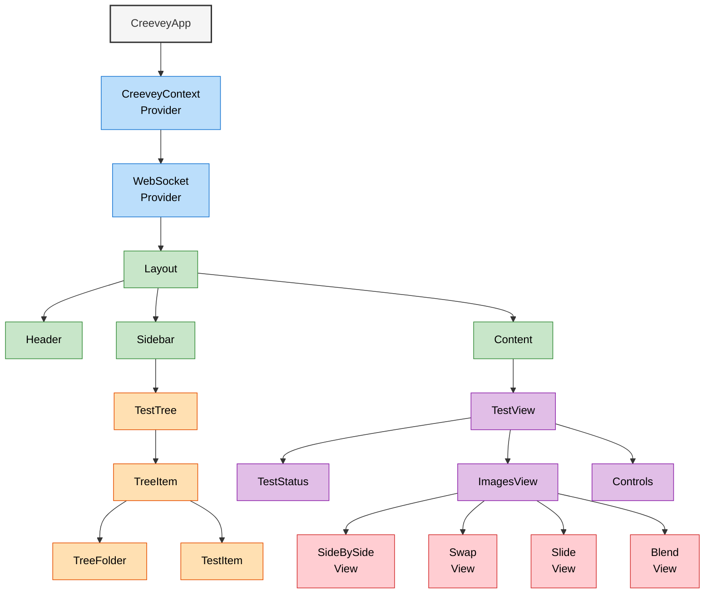
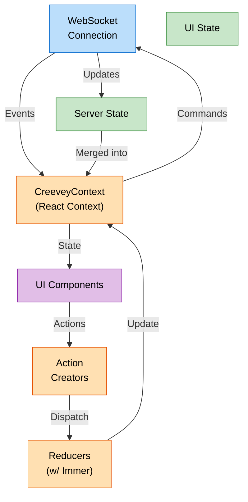
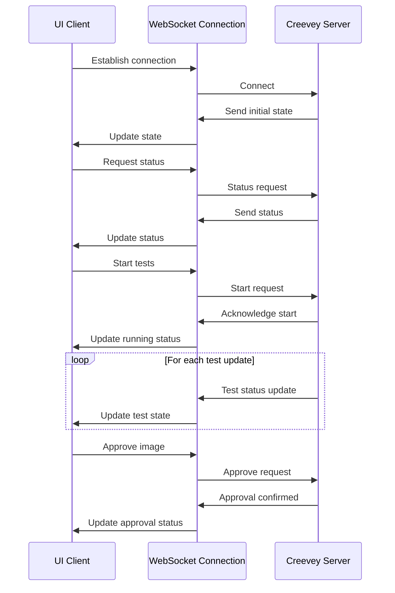
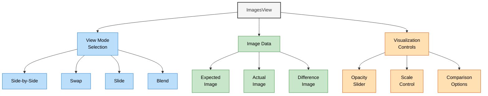
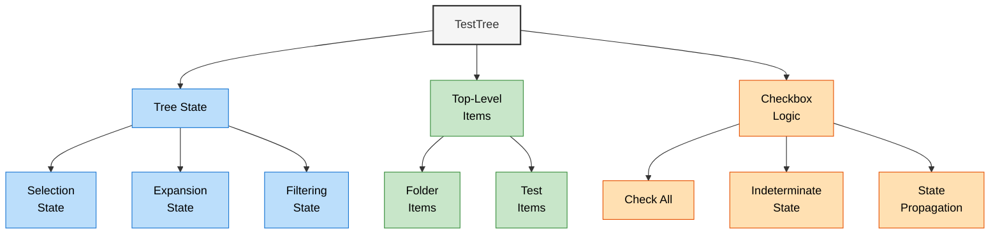
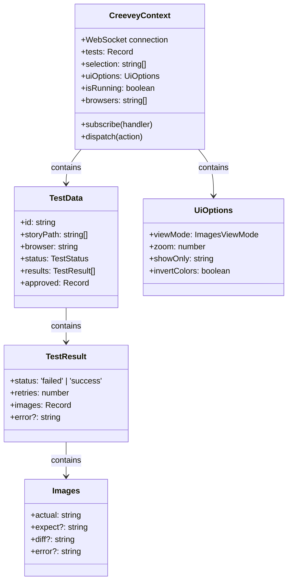
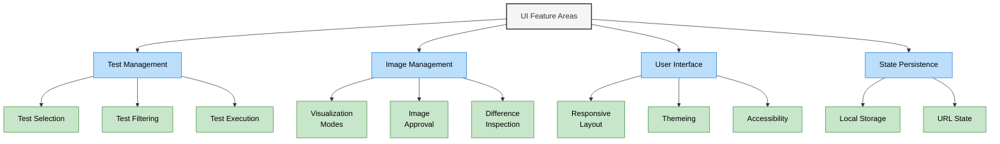

# UI Architecture Diagram

This document illustrates the React-based UI architecture in Creevey, showing the component hierarchy, state management, and communication patterns.

## UI Component Hierarchy

## State Management Flow

## WebSocket Communication Sequence

## Image Comparison Visualization

## Test Tree Implementation

## UI Context Structure

## UI Features Implementation

## Integration with Creevey Server

The UI integrates with the Creevey server through a WebSocket connection, enabling real-time updates and control of the test execution process. Key integration points include:

1. **State Synchronization**:

   - Server sends test status updates in real time
   - UI reflects the current state of tests, including results and images

2. **Command Execution**:

   - UI sends commands to start/stop tests
   - UI can approve test results

3. **Image Management**:
   - Server sends image data (base64 encoded)
   - UI provides visualization tools for comparing images

## Technology Stack

The UI is built with the following technologies:

- **Framework**: React
- **State Management**: React Context + Immer
- **Styling**: CSS modules
- **Communication**: WebSockets
- **Image Processing**: Canvas-based image comparison visualization
- **UI Components**: Custom React components

## Related Diagrams

This UI architecture diagram should be viewed alongside:

- System Architecture Overview
- Test Execution Flow Diagram
- WebSocket Communication Protocol
