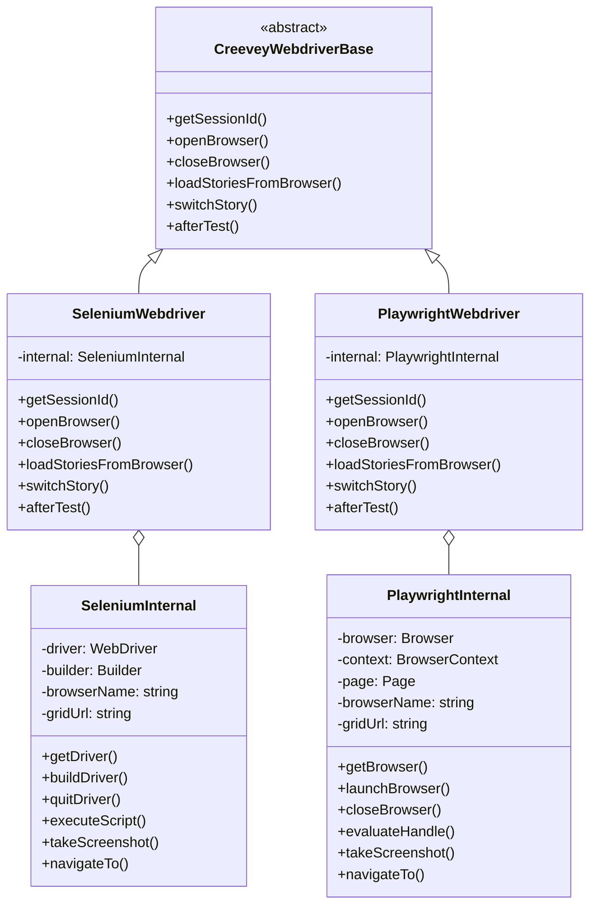
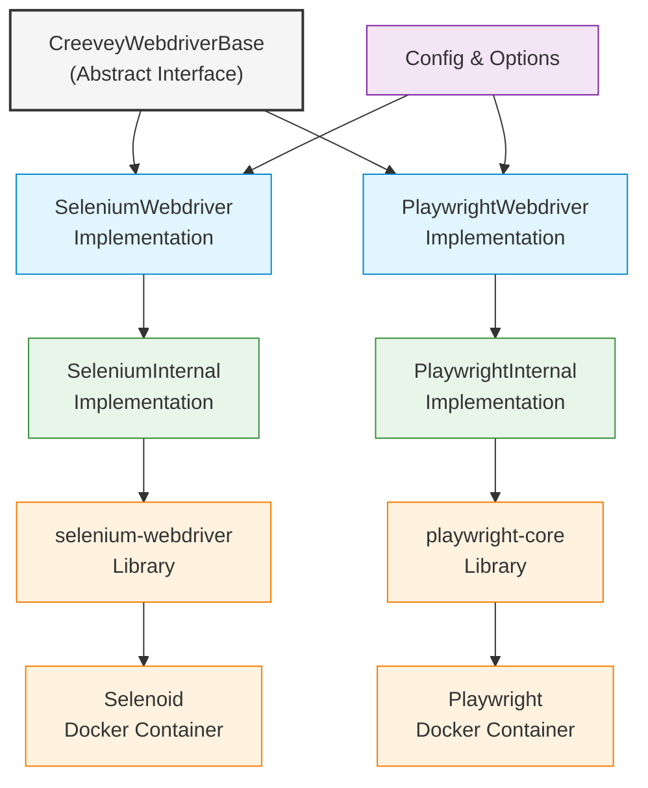
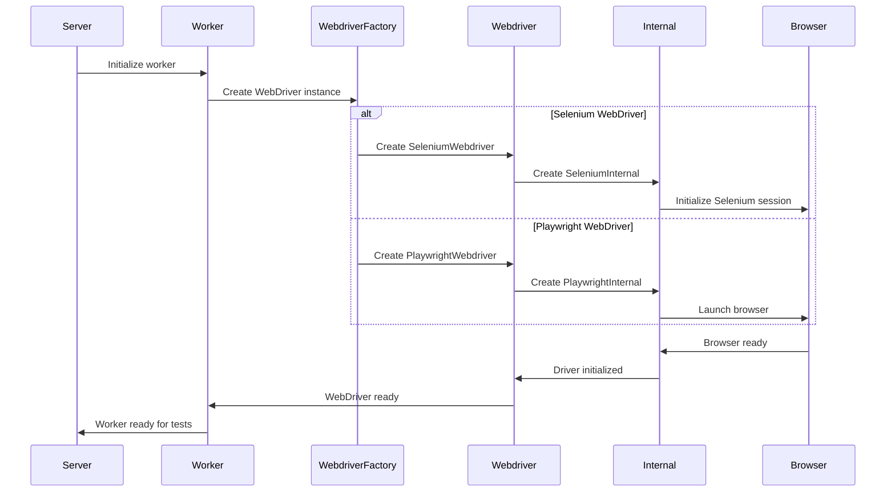
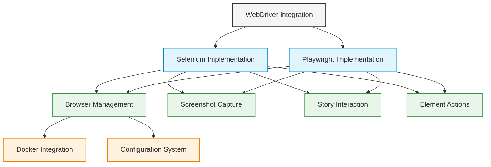

# WebDriver Integration Architecture

This document illustrates the WebDriver integration architecture in Creevey, showing the abstraction layers and implementations for both Selenium and Playwright.

## WebDriver Class Hierarchy



## WebDriver Implementation Component Diagram



## WebDriver Initialization Sequence



## WebDriver Functionality Components



## Configuration Options

The WebDriver implementations are controlled through several configuration options:

### Common Configuration Options

- `browserName`: Name of the browser to use
- `gridUrl`: URL to Selenium Grid or Playwright grid
- `viewport`: Browser viewport dimensions
- `limit`: Maximum number of parallel workers

### Selenium-Specific Options

- `seleniumCapabilities`: WebDriver capabilities
- `browserVersion`: Browser version to use
- `platformName`: Operating system to run on

### Playwright-Specific Options

- `playwrightOptions`: Options for Playwright browser launch
- `trace`: Configuration for Playwright tracing

### Docker Configuration

- `useDocker`: Whether to use Docker for browser isolation
- `dockerImage`: Custom Docker image to use
- `pullImages`: Whether to pull images or use local ones
- `dockerAuth`: Authentication for Docker registry
- `dockerImagePlatform`: Platform for Docker images

## Key Implementation Details

### CreeveyWebdriverBase Interface

The abstract interface that defines the core WebDriver operations required by Creevey:

```typescript
interface CreeveyWebdriver {
  getSessionId(): Promise<string>;
  openBrowser(fresh?: boolean): Promise<CreeveyWebdriver | null>;
  closeBrowser(): Promise<void>;
  loadStoriesFromBrowser(): Promise<StoriesRaw>;
  switchStory(story: StoryInput, context: BaseCreeveyTestContext): Promise<CreeveyTestContext>;
  afterTest(test: ServerTest): Promise<void>;
}
```

### Delegation Pattern

Both implementations use a delegation pattern, forwarding calls to an internal implementation class that handles the details of each WebDriver technology.

### Browser Lifecycle Management

- Browser instances are initialized when workers start
- They can be reused across multiple tests for efficiency
- They are properly closed when workers terminate

## Integration with Test Execution Flow

The WebDriver integration is a critical part of the test execution flow:

1. Worker requests a WebDriver instance
2. WebDriver launches a browser (via Selenium or Playwright)
3. Worker uses WebDriver to navigate to stories
4. WebDriver executes interactions and captures screenshots
5. WebDriver is properly closed when testing is complete

## Related Diagrams

This WebDriver architecture diagram should be viewed alongside:

- System Architecture Overview
- Test Execution Flow Diagram
- Docker Integration Architecture
- Storybook Integration Architecture
