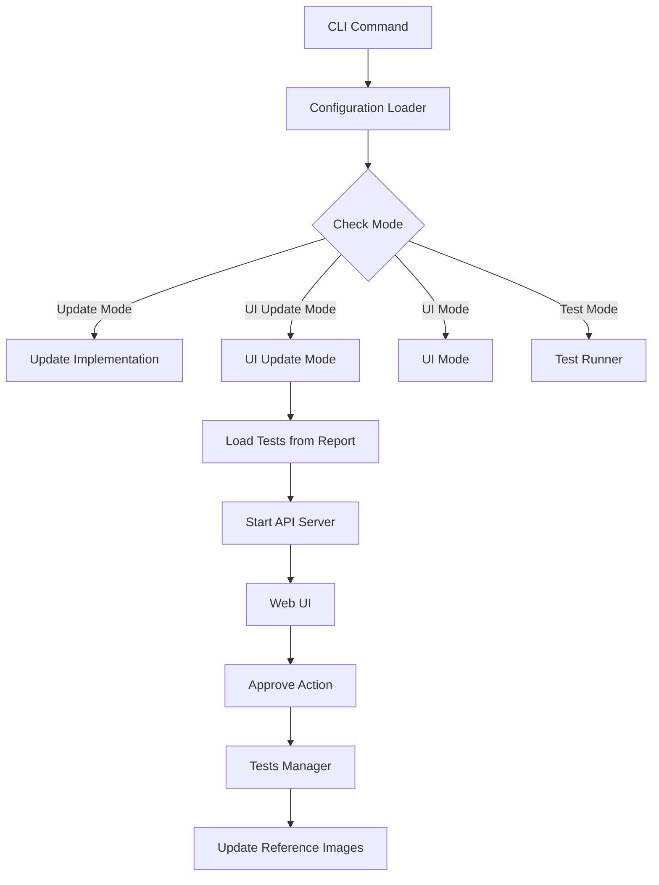

# Creevey Implementation Plan

## Update Mode Refactoring - Implementation Status

The Update Mode Refactoring has been successfully completed with the following key changes:

### 1. Server-Side Changes

- Modified the `CreeveyStatus` interface to include an `isUpdateMode` property:

  ```typescript
  export interface CreeveyStatus {
    isRunning: boolean;
    tests: Partial<Record<string, TestData>>;
    browsers: string[];
    isUpdateMode?: boolean;
  }
  ```

- Updated the `Runner` class to include `isUpdateMode` in its status response:

  ```typescript
  public get status(): CreeveyStatus {
    return {
      isRunning: this.isRunning,
      tests: this.testsManager.getTestsData(),
      browsers: this.browsers,
      isUpdateMode: false,
    };
  }
  ```

- Enhanced the `CreeveyApi` class to pass the `isUpdateMode` flag in status responses:
  ```typescript
  handleMessage(ws: WebSocket, message: WebSocket.Data): void {
    // ...
    switch (command.type) {
      case 'status': {
        const status = this.runner.status;
        status.isUpdateMode = this.isUpdateMode;
        ws.send(JSON.stringify({ type: 'status', payload: status }));
        return;
      }
      // ...
    }
    // ...
  }
  ```

### 2. Client-Side Changes

- Updated the `CreeveyContext` to include an `isUpdateMode` property:

  ```typescript
  export interface CreeveyContextType {
    // ...existing properties
    isUpdateMode: boolean;
    // ...other properties
  }
  ```

- Modified the `CreeveyApp` component to initialize and provide the `isUpdateMode` value:

  ```typescript
  export function CreeveyApp({ api, initialState }: CreeveyAppProps): JSX.Element {
    // ...
    return (
      <CreeveyContext.Provider
        value={{
          // ...other values
          isUpdateMode: initialState.isUpdateMode,
        }}
      >
        {/* ...component content */}
      </CreeveyContext.Provider>
    );
  }
  ```

- Updated UI components to access `isUpdateMode` directly from context:
  ```typescript
  // SideBarFooter.tsx
  export function SideBarFooter(): JSX.Element {
    const { onApproveAll, onImageApprove, onImageNext, isUpdateMode } = useCreeveyContext();
    // ...
    return (
      <>
        {isUpdateMode && (
          <UpdateModeBanner>Update Mode: Review and approve screenshots from previous test runs</UpdateModeBanner>
        )}
        {/* ...rest of component */}
      </>
    );
  }
  ```

### 3. API Method Standardization

- Renamed methods in TestsManager for consistency:

  - `approveTest` → `approve`
  - `approveAllTests` → `approveAll`

- Updated corresponding method calls in Runner and API classes.

### 4. Backward Compatibility

- Maintained backward compatibility by still checking for the URL parameter if the server doesn't provide the `isUpdateMode` flag:
  ```typescript
  if (data.payload.isUpdateMode !== undefined) {
    isUpdateMode = data.payload.isUpdateMode;
  } else if (urlHasUpdateParam) {
    isUpdateMode = urlHasUpdateParam;
  }
  ```

### Benefits of the Refactoring

1. **Single Source of Truth**: Server now controls and communicates the update mode status
2. **Simplified Component Design**: UI components access `isUpdateMode` directly from context
3. **Better Architecture**: Reduced coupling between components
4. **Consistent API**: Standardized method naming conventions
5. **Backward Compatible**: Existing URLs and bookmarks continue to work

### Next Steps

1. Complete the renaming of remaining TestsManager methods for consistency
2. Fix any remaining linting issues
3. Add comprehensive tests for the new implementation

---

# Original Implementation Plan

## Creevey Test Data Management Refactoring Implementation Plan

## Completed Documentation Tasks

- [x] Analysis of Creevey codebase architecture
- [x] Planning of documentation structure
- [x] Creation of all required architecture diagrams:
  - [x] Comprehensive architecture diagram
  - [x] System overview diagram
  - [x] Test execution flow diagram
  - [x] WebDriver integration diagram
  - [x] Storybook integration diagram
  - [x] UI architecture diagram
  - [x] Docker integration diagram
  - [x] Data flow diagram
  - [x] Technology stack diagram
- [x] Development Guide Creation
  - [x] Setup instructions
  - [x] Core concepts explanation
  - [x] API documentation
  - [x] Configuration options
  - [x] Example workflows
  - [x] Best practices
- [x] Performance Optimization Guide
  - [x] Configuration tuning strategies
  - [x] Browser optimization techniques
  - [x] Test selection strategies
  - [x] Parallelization techniques
  - [x] Resource management approaches
  - [x] CI optimization strategies
- [x] CI Integration Guide
  - [x] GitHub Actions configuration
  - [x] GitLab CI configuration
  - [x] CircleCI configuration
  - [x] Jenkins configuration
  - [x] Azure DevOps configuration
- [x] Advanced Examples Documentation
  - [x] Complex interactions examples
  - [x] Animation testing examples
  - [x] Parameterized testing examples
  - [x] Design system testing examples
  - [x] Cross-browser testing examples

## Current Implementation Tasks

### Phase 1: Test Data Management Refactoring (1-2 weeks)

1. Create the TestsManager class with basic structure and interfaces
2. Implement core functionality for test data operations
   - Loading tests from report
   - Merging tests from different sources
   - Saving tests to JSON
   - Updating tests incrementally
3. Refactor Runner class to use TestsManager
4. Update dependent components (master.ts, start.ts)
5. Add tests for the new implementation
6. Ensure backward compatibility

### Phase 2: Technical Debt Reduction (1 week)

1. Update outdated dependencies
2. Refactor WebDriver integration for better maintainability
3. Improve error handling throughout the codebase
4. Enhance test coverage for core components
5. Standardize configuration options

## Future Enhancement Tasks

### Phase 3: Performance Optimization (1-2 weeks)

1. Research and design optimal worker management strategy
2. Implement improved thread pooling for parallel test execution
3. Add test sharding capabilities for CI environments
4. Optimize image processing for faster comparisons
5. Implement test selection based on file changes

### Phase 4: Error Reporting Enhancement (1-2 weeks)

1. Design enhanced error reporting format
2. Implement structured error logging system
3. Add visual error indicators to UI Runner
4. Create error categories for better troubleshooting
5. Implement error aggregation for test runs

### Phase 5: Advanced Image Comparison (2-3 weeks)

1. Research AI-assisted image comparison options
2. Implement better difference highlighting
3. Add support for ignoring dynamic content
4. Create advanced threshold configuration options
5. Optimize comparison algorithms for speed

### Phase 6: UI Enhancement (2 weeks)

1. Add more visualization options for test results
2. Implement better filtering and search functionality
3. Create dashboard for test metrics
4. Improve responsiveness for large test suites
5. Add advanced reporting capabilities

## Implementation Constraints

- Maintain backward compatibility with existing configurations
- Ensure cross-platform compatibility (Windows, macOS, Linux)
- Keep performance overhead minimal
- Follow TypeScript best practices
- Add comprehensive tests for new features

## Milestones and Timeline

1. **Milestone 1: Test Data Management Refactoring** - End of Month 1

   - TestsManager class creation
   - Core functionality implementation
   - Refactored Runner class
   - Dependent components update
   - New implementation tests
   - Backward compatibility

2. **Milestone 2: Technical Debt Reduction** - Mid-Month 2

   - Updated dependencies
   - Refactored WebDriver integration
   - Improved error handling
   - Enhanced test coverage
   - Standardized configuration

3. **Milestone 3: Performance Optimization** - End of Month 2 (Future)

   - Improved test parallelization
   - Optimized image processing
   - Test sharding implementation

4. **Milestone 4: Error Reporting Enhancement** - Mid-Month 3 (Future)

   - Enhanced error format
   - Structured error logs
   - Visual error indicators

5. **Milestone 5: Advanced Image Comparison** - End of Month 3 (Future)

   - Better difference highlighting
   - Dynamic content ignoring
   - Optimized comparison algorithms

6. **Milestone 6: UI Enhancement** - Mid-Month 4 (Future)
   - Enhanced visualization
   - Improved filtering
   - Test metrics dashboard

## Resources Required

- Access to Creevey codebase
- Development environment with Node.js and TypeScript
- Multiple browsers for cross-browser testing
- Docker for container testing
- CI environment for integration testing

## Implementation Approach

### Development Methodology

- Feature-branch workflow
- Test-driven development where appropriate
- Code reviews for all changes
- Continuous integration for automated testing
- Regular documentation updates

### Quality Assurance

- Unit tests for new functionality
- Integration tests for system components
- End-to-end tests for critical workflows
- Performance benchmarks for optimization work
- Cross-browser compatibility testing

## Success Criteria

- Performance improvements are measurable and significant
- Error reporting provides actionable information
- New features maintain backward compatibility
- Documentation is updated to reflect changes
- All tests pass consistently across platforms
- Code quality meets established standards

## Test Data Management Refactoring - Detailed Plan

### Background

Currently, the runner directly updates tests data and results inside its methods. This creates a tight coupling between test execution and test data management. Refactoring this into a separate class will improve code organization, maintainability, and make future enhancements easier.

### Design

#### TestsManager Class Structure

```typescript
// src/server/testsFiles/testsManager.ts
import { EventEmitter } from 'events';
import { ServerTest, TestData, TestMeta, TestResult, TestStatus, CreeveyUpdate, ApprovePayload } from '../../types.js';

export interface TestsManagerEvents {
  update: (update: CreeveyUpdate) => void;
}

export class TestsManager extends EventEmitter {
  private tests: Partial<Record<string, ServerTest>> = {};

  // Get a copy of all tests
  public getAllTests(): Partial<Record<string, ServerTest>> {
    return { ...this.tests };
  }

  // Get test data as status object
  public getTestsData(): Partial<Record<string, TestData>> {
    // Implementation
  }

  // Load tests from report
  public loadTestsFromReport(reportPath: string): Partial<Record<string, TestData>> {
    // Implementation
  }

  // Merge tests from stories with tests from report
  public mergeTests(testsFromStories: Partial<Record<string, ServerTest>>): void {
    // Implementation
  }

  // Update tests with incremental changes
  public updateTests(testsDiff: Partial<Record<string, ServerTest>>): void {
    // Implementation
  }

  // Update test result
  public updateTestResult(id: string, status: TestStatus, result?: TestResult): void {
    // Implementation
  }

  // Save tests to JSON
  public saveTestsToJson(reportDir: string): void {
    // Implementation
  }

  // Approve test
  public async approveTest(payload: ApprovePayload): Promise<void> {
    // Implementation
  }

  // Approve all tests
  public async approveAllTests(): Promise<void> {
    // Implementation
  }
}
```

### Implementation Steps

1. **Create TestsManager Structure (Days 1-2)**

   - Create the base class with its interface
   - Implement initial data storage and event emission

2. **Core Data Operations (Days 3-5)**

   - Implement loading tests from report
   - Implement test data merging
   - Implement saving tests to JSON
   - Implement incremental test updates
   - Add test result updating

3. **Refactor Runner (Days 6-8)**

   - Remove direct test data handling
   - Update Runner to reference TestsManager
   - Ensure events are properly propagated
   - Fix test execution handling

4. **Update Dependent Components (Days 9-10)**

   - Refactor master.ts to use TestsManager
   - Update start.ts for report generation
   - Fix any other components with direct test access

5. **Testing (Days 11-12)**

   - Add unit tests for TestsManager
   - Test full execution flow
   - Validate backward compatibility

6. **Documentation and Cleanup (Days 13-14)**
   - Document the new API
   - Clean up any remaining issues
   - Update architecture documentation

### Affected Files

- `src/server/testsFiles/testsManager.ts` (New file)
- `src/server/testsFiles/index.ts` (New file)
- `src/server/master/runner.ts` (Significant changes)
- `src/server/master/master.ts` (Moderate changes)
- `src/server/master/start.ts` (Minor changes)
- `src/server/stories.ts` (Move functions)
- `src/server/utils.ts` (Move functions)

### Backward Compatibility

This refactoring will maintain the same external API, ensuring that all existing functionality continues to work without changes to consumer code. The event system will be preserved, and the data structure will remain the same.

### Testing Strategy

- Unit tests for TestsManager methods
- Integration tests for Runner and TestsManager interaction
- End-to-end tests for the full execution flow
- Regression tests to ensure existing functionality works

### Risks and Mitigation

- **Risk**: Regression in test execution behavior
  - **Mitigation**: Comprehensive test coverage and careful refactoring
- **Risk**: Performance degradation

  - **Mitigation**: Benchmark before and after the changes

- **Risk**: Event handling issues
  - **Mitigation**: Thorough testing of all event paths

### Success Criteria

- All existing tests continue to pass
- Code is more maintainable and organized
- The Runner class is simpler and more focused
- Test data operations are centralized and consistent

# UI Update Mode Implementation Plan

## Overview

This document outlines the implementation plan for a new Creevey feature: UI Update Mode. This mode will allow users to review and approve screenshots from the browser, combining the functionality of both existing `--ui` and `--update` flags.

## Requirements

1. Create a new operation mode that loads tests metadata from the report
2. Enable the API server to allow approving screenshots from the UI
3. Allow users to run Creevey with both `--ui` and `--update` flags
4. Use the TestsManager to load test data from report
5. Implement UI interactions to approve images

## System Architecture



## Implementation Details

### 1. CLI Integration

We need to modify the CLI handling to recognize when both `--ui` and `--update` flags are used together.

```typescript
// src/creevey.ts
const argv = minimist<Options>(process.argv.slice(2), {
  string: ['browser', 'config', 'reporter', 'reportDir', 'screenDir', 'gridUrl', 'storybookUrl', 'storybookPort'],
  boolean: ['debug', 'trace', 'ui', 'odiff', 'noDocker', 'update'],
  default: { port: '3000' },
  alias: { port: 'p', config: 'c', debug: 'd', update: 'u', storybookStart: 's' },
});
```

### 2. Server Implementation

Modify the server implementation to handle the new UI update mode:

```typescript
// src/server/index.ts
export default async function (options: Options): Promise<void> {
  const config = await readConfig(options);
  const { browser = defaultBrowser, update, ui, port } = options;
  let gridUrl = cluster.isPrimary ? config.gridUrl : options.gridUrl;

  // ... existing code ...

  switch (true) {
    case Boolean(update) && Boolean(ui): {
      // New UI Update mode
      await import('./ui-update.js').then(({ uiUpdate }) => uiUpdate(config, port));
      return;
    }
    case Boolean(update): {
      (await import('./update.js')).update(config, typeof update == 'string' ? update : undefined);
      return;
    }
    // ... existing cases ...
  }
}
```

### 3. UI Update Mode Implementation

Create a new file to handle the UI update mode:

```typescript
// src/server/ui-update.ts
import path from 'path';
import { Config } from '../types.js';
import { logger } from './logger.js';
import { TestsManager } from './master/testsManager.js';
import { start as startServer } from './master/server.js';

export async function uiUpdate(config: Config, port: number): Promise<void> {
  logger().info('Starting UI Update Mode');

  // Initialize TestsManager with the configured directories
  const testsManager = new TestsManager(config.screenDir, config.reportDir);

  // Load tests from the report
  const testsFromReport = testsManager.loadTestsFromReport();

  if (Object.keys(testsFromReport).length === 0) {
    logger().warn('No tests found in report. Run tests first to generate report data.');
    return;
  }

  // Set tests in the manager
  testsManager.updateTests(testsFromReport);

  // Start API server with UI enabled
  const resolveApi = startServer(config.reportDir, port, true);

  // Initialize API
  const { CreeveyApi } = await import('./master/api.js');
  const api = new CreeveyApi(testsManager, config);

  // Resolve the API for the server
  resolveApi(api);

  logger().info(`UI Update Mode started on http://localhost:${port}`);
  logger().info('You can now review and approve screenshots from the browser.');
}
```

### 4. Modifications to API

Update the API to include methods for the UI update mode:

```typescript
// src/types.ts
export interface Options {
  // ... existing options ...
  ui?: boolean;
  update?: boolean | string;
}
```

### 5. UI Modifications

Ensure the UI correctly handles the update mode:

```typescript
// src/client/shared/creeveyClientApi.ts
export interface CreeveyClientApi {
  // ... existing interface ...
  isUpdateMode: boolean;
}

export async function initCreeveyClientApi(): Promise<CreeveyClientApi> {
  // ... existing code ...

  clientApiResolver({
    // ... existing properties ...
    isUpdateMode: new URLSearchParams(window.location.search).has('update'),
  });

  // ... existing code ...
}
```

### 6. UI Components Update

Update UI components to show appropriate controls in update mode:

```typescript
// src/client/web/CreeveyView/SideBar/SideBarFooter.tsx
// Add appropriate UI elements to indicate update mode is active
```

## Testing Strategy

1. **Unit Tests**:

   - Test the new UI update mode function
   - Test loading tests from report in update mode
   - Test TestsManager integration

2. **Integration Tests**:

   - Test the full flow from CLI to UI
   - Test approve actions in the UI

3. **Manual Testing**:
   - Run with `--ui --update` flags
   - Verify screenshots can be approved
   - Verify changes are properly saved

## Implementation Steps

1. Modify CLI to handle combined flags
2. Create UI update mode implementation
3. Update TestsManager integration
4. Modify UI to handle update mode
5. Test the implementation
6. Update documentation

## Potential Challenges

1. **Test Data Format**: Ensure that test data loaded from the report is compatible with the UI
2. **Concurrency Issues**: Handle potential concurrent approvals
3. **UI Feedback**: Provide appropriate feedback when approvals are processed

## Timeline

- Implementation: 2-3 days
- Testing: 1-2 days
- Documentation: 1 day

## Documentation Updates

Update the following documentation:

- Command line options
- User guide for the UI update mode
- Development guide for extending the functionality

## Usage Example

To use the UI Update Mode, run Creevey with both the `--ui` and `--update` flags:

```bash
# Using npm
npm run creevey -- --ui --update

# Using yarn
yarn creevey --ui --update

# Using npx
npx creevey --ui --update
```

This will:

1. Load existing test results from the previous test run
2. Start the web UI server
3. Allow you to browse and approve screenshots from your browser

When the UI loads, you'll see an "Update Mode" indicator in the header, showing that you can approve screenshot changes.

### Workflow

A typical workflow with UI Update Mode would be:

1. Run your tests normally first: `yarn creevey`
2. Review failed tests and determine which changes are expected
3. Run in UI Update Mode: `yarn creevey --ui --update`
4. Approve the expected changes through the browser interface
5. Run tests again to verify all tests now pass: `yarn creevey`

This feature is especially useful for teams that need to collaboratively review and approve visual changes, as it provides a user-friendly interface for approving screenshots rather than using command-line tools.
